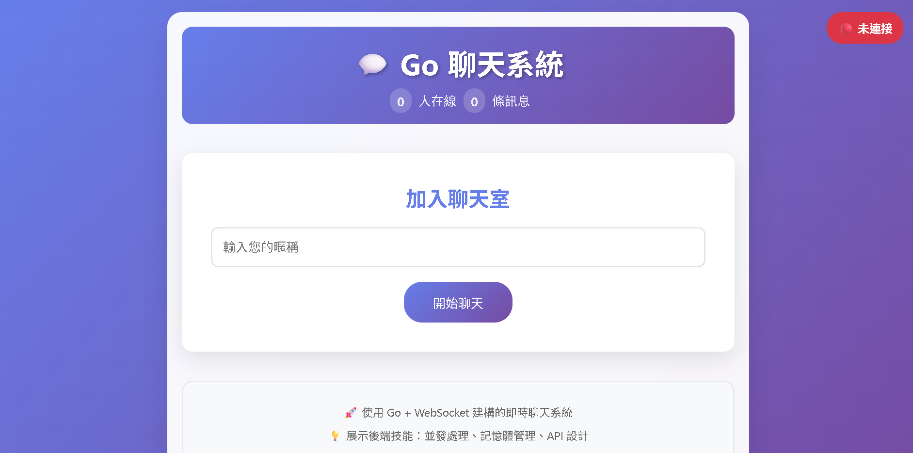

# 🚀 Go 聊天系統


一個基於 Go 和 WebSocket 的即時聊天系統，採用模組化架構設計。

## 🏗️ 架構特點

### 🔧 模組化設計
- **`cmd/server/`**: 主程序入口點
- **`internal/chat/`**: 聊天室核心邏輯
- **`internal/websocket/`**: WebSocket 連接管理
- **`internal/api/`**: HTTP API 處理
- **`internal/config/`**: 配置管理
- **`pkg/utils/`**: 通用工具函數
- **`web/`**: 前端資源

### ✨ 主要功能
- 即時聊天
- 用戶加入/離開通知
- 聊天記錄保存
- 系統統計資訊
- 支援多用戶同時在線

## 🚀 快速開始

### 📋 前置需求
- Go 1.24.5 或更高版本

### 📦 安裝依賴
```bash
go mod tidy
```

### ▶️ 運行服務
```bash
# 開發模式
air -d

# 簡易執行模式
go run cmd/server/main.go
```

服務將在 `:8080` 端口啟動。

### ⚙️ 環境變數
- `PORT`: 服務端口 (預設: 8080)
- `MAX_MESSAGES`: 最大保存訊息數量 (預設: 100)

## 🔌 API 端點

### 🌐 WebSocket
- `GET /ws?username=<username>`: WebSocket 連接

### 📡 HTTP API
- `GET /api/messages`: 獲取聊天記錄
- `GET /api/stats`: 獲取系統統計

## 🎨 前端

訪問 `http://localhost:8080` 即可使用聊天界面。

## 🎯 架構優勢

1. **關注點分離**: 每個模組只負責特定功能
2. **易於測試**: 可以獨立測試每個組件
3. **易於擴展**: 新增功能時不會影響現有代碼
4. **代碼重用**: 聊天室邏輯可以在其他項目中重用
5. **團隊協作**: 不同開發者可以專注於不同模組

## 👨‍💻 開發指南

### ➕ 添加新功能
1. 在相應的模組中添加新邏輯
2. 更新 API 處理器（如需要）
3. 添加測試
4. 更新文檔

### 🧪 測試
```bash
go test ./...
```

## 🚀 部署

### 🐳 Docker
```bash
docker build -t go-chat-system .
docker run -p 8080:8080 go-chat-system
```

### 🌍 生產環境
- 設置適當的 CORS 策略
- 配置日誌記錄
- 添加監控和健康檢查
- 考慮使用 Redis 等外部存儲來持久化聊天記錄
